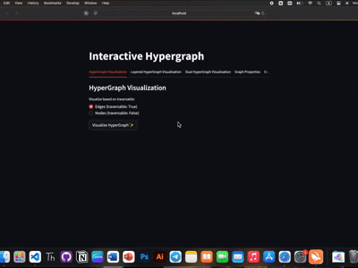

# Multiway Graphs (Hypergraph)

  
  

## 🎥 Demo

Watch the demo in action!  
[]

## 📌 Project Overview

- py_script/hypergraph.py -> visualizes a hypergraph based on the given info
- py_script/dual_hypergraph.py -> visualizes the dual hypergraph based on the hypergraph
- py_script/layered_hypergraph.py -> visualizes the layered graph based on the hypergraph
- py_script/main.py -> utilizes a web app for displaying the graph info
- src/main.py -> compiles Python code and handling streamlit

## 🚀 How to Run?

1️⃣ **Install Python** if you haven't yet. Verify with:  
`python3 --version`

2️⃣ Enter the `rust-python-integration` directory

3️⃣ Activate your Python environment

1. `python3 -m venv myvenv`
2. `source myvenv/bin/activate`

4️⃣ install dependencies
- `pip install -r requirements.txt`

5️⃣ Ensure your library path is correctly picked up
- `echo $SHELL`

- if needed, update your `build.rs` file based on the output
  - `println!("cargo:rustc-link-search=native=/usr/local/opt/python@3.13/Frameworks/Python.framework/Versions/3.13/lib");`

6️⃣ If using Zsh, Bash, Fish, etc., configure the shell:
1. `nano ~/.zshrc  # (Or ~/.bashrc, ~/.fishrc, etc.)`

- add this line:
2. `export LIBRARY_PATH=$(python3.13-config --prefix)/lib`

- Save & exit (`CTRL + O`, `ENTER`, `CTRL + X`)
  
- then apply changes:
3. `source ~/.zshrc  # (Or ~/.bashrc, ~/.fishrc, etc.)`

7️⃣ Compile & run:
1. `cargo clean`
2. `cargo build`
3. `cargo run`
